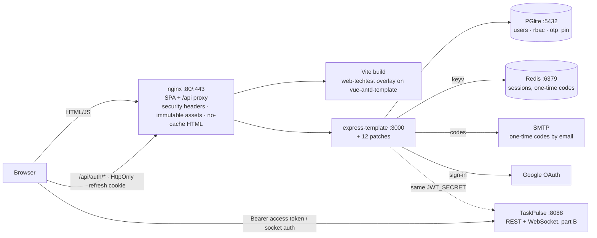

# vue-express-deploy

Deployment kit for the es-labs **Vue + Express** templates (part 1 of the technical test): the fixes and
extensions the templates need, the custom frontend app, and the scripts that put the stack on a Linux host
behind nginx.

This repo contains **no code from es-labs**. Both templates are cloned at deploy time and pinned to the
commits validated in the setup notes:

| Template | Commit |
|---|---|
| `es-labs/express-template` | `db883cd` |
| `es-labs/vue-antd-template` | `99a34fa` |

| Path | What it does |
|---|---|
| `patches/` + `patches/apply.sh` | seventeen patches applied to a checkout of `express-template`, in order: `0001` keyv string keys (login broke on `keyv@5`), `0002` awaited OTP verify (**security fix** — any code was accepted), `0003` EMAIL one-time codes + secrets from the environment, `0005` sign-up (the template ships a TODO stub and a dead `/signup` link), `0007` `GET /api/auth/providers` (the UI shows only what the server can do), `0008` Google sign-in, `0009` per-account default code (`users.otp_pin`: seeded demo accounts sign in with `111111`, every other account gets its code by email), `0010` token refresh that actually works (the handler read the refresh token from cookie/header/query while the template's own client posts it in the body, and looked the user up by email with the numeric id — every refresh was a 401 and a forced sign-out), `0011` `user_meta` (email) carried in the JWT so the C# API can name the actor in its audit trail, `0012` rate limit on `/login`, `/otp`, `/signup` (10/min per client, keyed on `X-Forwarded-For` behind nginx → 429), `0013` sessions in **Redis** through `@keyv/redis` when `KEYV_REDIS_URL` is set (sign-ins survive an API restart), `0014` **HttpOnly** refresh cookie — with `COOKIE_HTTPONLY` the refresh token never reaches JSON; `/refresh` reads it from the cookie, `0015` refresh-token **rotation with reuse detection** (a rotated-away token presented again after a 10 s two-tab leeway revokes the whole family → both sides sign in again), `0016` **`/api/users`** (kit file `users.js`): the portal's Team Members are real accounts on the template's `users` table — list for any signed-in user, create (one-time temporary password, optional fixed demo code) / rename / roles / revoke / delete for `Admin`, never your own Admin role, revocation or deletion, `0019` **account lockout** — five wrong passwords lock the account for 15 minutes (423, also with the right password; the last two attempts warn), kept in the session store; an Admin unlocks from the Dashboard (`PUT /api/users/:id {unlock:true}`), `0020` **one session per device** (kit file `sessions.js`): the store keeps up to 8 sessions per user (device, address, created, last seen), a sign-in on a phone no longer signs the laptop out, refresh rotates only its own token, logout ends this device, `?all=1` ends all; `GET/DELETE /api/auth/sessions` back the Profile page's device list, `0021` **sign-in events in the audit trail** (kit file `audit-client.js`): sign-ins, wrong passwords, wrong codes, lockouts, sign-outs, refresh reuse and account changes are posted to TaskPulse's `POST /api/audit` (shared `TASKPULSE_AUDIT_TOKEN`), fire-and-forget; Admins see them on the Dashboard. Idempotent, marker-based. |
| `patches/seed-demo-accounts.mjs` | run by `bootstrap.sh` after the template seeds: creates `admin@` / `demo@` / `viewer@techtest.dev` (password `Techtest123!`) and gives them and the template's seed users the default code `111111`; idempotent |
| `migrations/` | kit migration copied next to the template's before `migrate:latest`: adds `users.otp_pin` |
| `web-techtest/` + `web-techtest/apply.sh` | the custom frontend app, created as a copy of the template's `web-sample` with `web-techtest/app/` laid over it — the customisation route the template README prescribes, so `web-sample` is never edited. Registers `npm run techtest` / `techtest:build`; ships its own `setups/routes.js` (curated menu, `/signup`, new pages). Keyboard-first: `Ctrl`/`⌘ K` opens a command palette (pages, actions, and what the open page adds — `shortcuts.js` registry), `g d` / `g t` / `g a` / `g p` jump between pages, `n` / `/` / `e` on Tasks, `t` flips the theme, `?` lists them; nothing fires while typing in a field. |
| `systemd/` | `vt-db` (PGlite server), `vt-api` (Express), `vt-fe` (Vite) units for running the stack as services on a dev box |
| `e2e/` | browser end-to-end checks with puppeteer-core + axe-core against a running stack (`e2e/run.sh`, `E2E_BASE` / `E2E_TASKPULSE` for the public URLs): every page renders without errors, session survives a reload and idle sign-out, dashboard numbers match the API, a second tab follows change events, optimistic delete, account lockout, signed-in devices, task fields + filters, CSV round trip, a webhook delivery, record history with diffs, an idempotent create replay, cursor paging vs offset, the command palette and key chords, and a WCAG 2.1 AA axe audit of each page in light and dark |
| `cloud/bootstrap.sh` | one-shot install of **both** technical-test parts on a fresh Ubuntu VM behind nginx — expects to live in `<submission>/code/vue-express-deploy/cloud` next to `code/taskpulse` |

## Architecture



The templates are cloned untouched at deploy time; `patches/apply.sh` and `web-techtest/apply.sh` produce the running
app from them. The access token express signs is the only credential the browser holds; TaskPulse validates it with the
same secret, so one sign-in covers both parts.

## Configuration

The API reads secrets from the environment only (`systemd/vt-api.service` loads a root-only
`EnvironmentFile`, `/etc/vt/api.env`; `cloud/bootstrap.sh` writes the same file on the VM). Nothing secret
is committed.

| Variable | Purpose |
|---|---|
| `USE_OTP` | `EMAIL` (one-time code by mail), `GA` (authenticator), `TEST` (fixed `111111`) |
| `SMTP_HOST` `SMTP_PORT` `SMTP_USER` `SMTP_PASS` `SMTP_FROM` | mailer for `USE_OTP=EMAIL`; unset → codes are printed to the log |
| `GOOGLE_CLIENT_ID` `GOOGLE_CLIENT_SECRET` `GOOGLE_CALLBACK` | Google OAuth client; callback is `<api>/api/google/callback` |
| `TASKPULSE_AUDIT_URL` `TASKPULSE_AUDIT_TOKEN` | where sign-in events are reported (TaskPulse `/api/audit`, token from `/etc/taskpulse/api.env`); unset → not reported |
| `KEYV_REDIS_URL` | `redis://127.0.0.1:6379` — session store in Redis instead of process memory (patch `0013`); unset → in-memory as the template ships |
| `JWT_SECRET` | the template's 9-character default is replaced with 48 random characters by `bootstrap.sh`; the same value goes to TaskPulse (`TASKPULSE_JWT_SECRET`) so one sign-in works against both APIs |

The kit also flips two template settings in `.env.json` rather than the code: `COOKIE_HTTPONLY: true` (refresh token in an HttpOnly cookie only, `secure` when the origin is https) and `COOKIE_OPTS.maxAge` from `0` (Express expires the cookie immediately) to one day; the frontend sends `credentials: include`.

The **Continue with Google** button is shown only when `GOOGLE_CLIENT_ID` and `GOOGLE_CLIENT_SECRET` are both set
(`GET /api/auth/providers` reports it).

Two second factors coexist under `USE_OTP=EMAIL`: the seeded accounts (`test`, `ais-one`, `aaronjxz`, password `test`)
carry `otp_pin = 111111` and always use it; accounts created by sign-up or Google have no pin and receive a real
6-digit code by email — at sign-up (activation) and at every later sign-in.

## Apply to a checkout

```bash
git clone https://github.com/es-labs/express-template && git -C express-template checkout db883cd
git clone https://github.com/es-labs/vue-antd-template && git -C vue-antd-template checkout 99a34fa
bash patches/apply.sh express-template            # then: cd express-template && npm i
bash web-techtest/apply.sh vue-antd-template      # then: cd vue-antd-template/apps && npm run techtest
```

## Why the template needed fixing

See `docs/vue-express-notes.md` in the submission: stale migration README, a Postgres role the migration
assumes, alphabetical seed ordering, `keyv@5` requiring string keys, and an un-awaited async OTP verify that
accepted any code.
